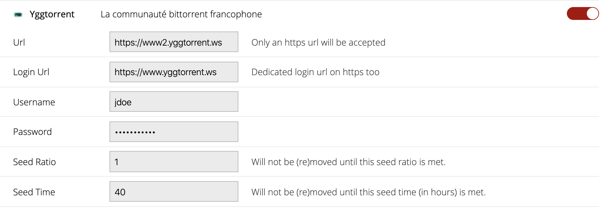

# potatoygg

[](https://travis-ci.org/Ripolin/potatoygg)
[](https://coveralls.io/github/Ripolin/potatoygg?branch=master)

Ygg torrent provider implementation for CouchPotato.

## How to install

Once checkout, copy the `ygg` directory directly under the `DATA_DIR/customs_plugin` directory of your CouchPotato server. When it's done, restart it. You'll see a new entry Yggtorrent on the *Settings>Searcher* location.

## How to update YGG location

To update YGG location using CouchPotato webapp, go into *Settings>Searcher*, look for Yggtorrent entry and modify properties:
* Url : base URL used to search movies
* Login Url : base URL used to login to Ygg

Example:



## Development

Be sure you're running the latest version of [Python 2.7](http://python.org/).

### Tests

More information in the [test directory](test).

## Issues

Use issue tracker.

## Additional information

It's not the purpose of this plugin to manage additional languages for searching torrents. As lucky we are, CouchPotato does this job. Just verify in your `settings.conf` file in your `DATA_DIR` directory that you have the property `languages` correctly filled in the `core` section.

Example :

```ini
[core]
...
languages = fr
```

Now CouchPotato is able to retrieve any movie's french title. Just select it and the plugin does the rest.

The `languages` property is a comma separated list of locales and CouchPotato recognize the first entry value as the default one. Furthermore it's useless to append the english locale `en` to this list cause CouchPotato always use it automatically.

Multiple locales configuration example :

```ini
[core]
...
languages = fr,de,sp,it
```

